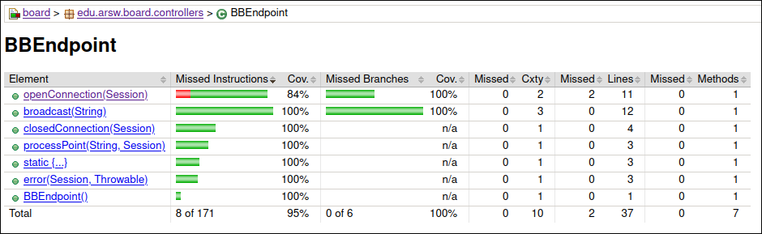
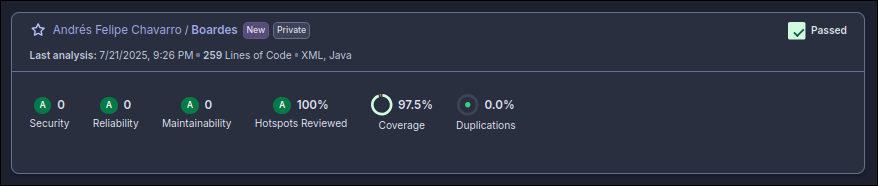
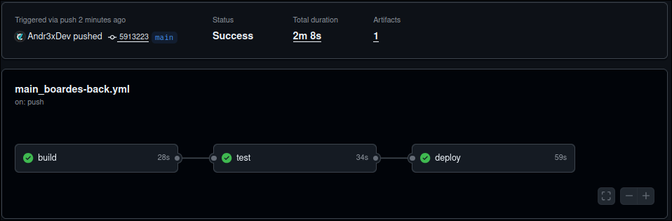

<div align="center">
    <h1 align="center">Boardes Back</h1>
    <p align="center">
Backend WebSocket endpoint designed to facilitate real-time collaboration. It enables multiple clients to connect and exchange messages instantly.
    </p>
</div>

</br>

> [!IMPORTANT]  
> This Backend is used by this frontend app, wich uses this project as 
> - Frontend: https://github.com/Andr3xDev/Boardes

</br>


## Functionality Overview

The core functionality revolves around a single WebSocket endpoint (/board) that acts as a central hub for all connected clients. When a client sends a message related with the action of a client, this message is immediately broadcast to all other active sessions. This ensures that every participant sees updates as they happen, creating a seamless collaborative experience.

### Key features include:

- Real-time Messaging: Instantaneous delivery of messages to all connected clients.
- Session Management: Handles client connections (@OnOpen), disconnections (@OnClose), and errors (@OnError).
- Message Persistence: Stores a history of messages in a list and sends them to new clients upon connection, allowing them to catch up on past events.

</br>
</br>


## How It Works

The controller class leverages Java's WebSocket API, integrated with Spring's @Component annotation for Spring Boot applications.

- @ServerEndpoint("/board"): Defines the WebSocket endpoint accessible at ws://url/board.
- @OnOpen: Executed when a new client connects. It adds the session to a shared queue and sends an initial "connection established" message, followed by all previously broadcasted messages to synchronize the new client.
- @OnMessage: Triggered when a client sends a message. It processes the message and then calls the broadcast method.
- broadcast: A static method responsible for iterating through all active sessions in the queue and sending the given message to each one. It also manages the messages history.
- @OnClose: Removes the session from the queue when a client disconnects gracefully.
- @OnError: Handles exceptions during the WebSocket communication, removing the problematic session.

### Running local

To use this app in locahost to test it, use the following commands:

- Get the code:

```sh
git clone 
cd boardes-back
```

- Compile code using maven:

```sh
mvn verify
```

- Run Springboot

```sh
mvn spring-boot:run
```

</br>
</br>

## Testing and Analysis

This project emphasizes code quality and reliability through comprehensive testing and static analysis.

- Unit Tests: Written using JUnit 5 and Mockito to ensure individual components behave as expected. Mockito is used to simulate WebSocket Session and RemoteEndpoint.Basic objects, allowing for isolated testing of the endpoint's logic.
- Code Coverage: Jacoco is integrated to measure test coverage, ensuring that a high percentage of the codebase is exercised by the unit tests. This helps identify untested areas and improve test suite robustness.
- Static Code Analysis: SonarCloud is used for static code analysis. It identifies potential bugs, code smells, security vulnerabilities, and enforces coding standards, contributing to maintainable and high-quality code.





Make sure you have your SonarCloud token configured or passed via the -Dsonar.token property. The -Dsonar.organization and -Dsonar.host.url parameters are crucial for connecting to your specific SonarCloud instance and organization.

### Deployment

This application can be deployed to various cloud platforms such as AWS, Google Cloud Platform, or Azure. Ensure that the chosen environment supports WebSocket connections and that any necessary firewall rules or load balancer configurations are in place to allow WebSocket traffic. For example, this project was deployed in Azure with the custom pipeline in the source code.


